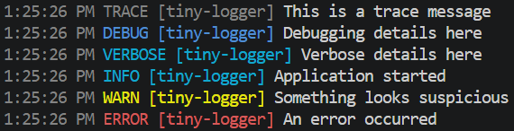

# tiny-logger

`tiny-logger` is a lightweight logger compatible with [ts-log](https://github.com/kallaspriit/ts-log), featuring customizable formatting support.

---

## Features

- Color-coded log levels (`TRACE`, `DEBUG`, `VERBOSE`, `INFO`, `WARN`, `ERROR`, `FATAL`).
- Optional prefix for log messages.
- Compatible with the `ts-log` interface, providing a polyfill for the `verbose` level.
- Automatically disables color when `NO_COLOR` is set or the output is not a TTY, with an explicit override via the `colorize` option.
- Every part of the output line (time, level, prefix, message) can be customized via format hooks.

---

## Installation

```bash
npm install @wicle/tiny-logger
```

## Usage

### Create a Logger

```ts
import { createLogger } from "@wicle/tiny-logger";

const logger = createLogger({ prefix: "MyApp", level: "trace" });

// Log messages
logger.trace("This is a trace message");
logger.debug("Debugging details here");
logger.verbose("Verbose granular details here");
logger.info("Application started");
logger.warn("Something looks suspicious");
logger.error("An error occurred");

// Logging native errors with full stack trace preservation
logger.error({ err: new Error("Database connection timeout") }, "Query failure");
```

Output is formatted as `H:MM:SS AM/PM LEVEL prefix message`, with the level and prefix color-coded when writing to a TTY.

**tiny-logger sample output:**



### Default Logger

A predefined default logger instance. It runs at the `info` level in an environment with auto-detected color support.
**Caution:** Because this is a global instance, modifying its properties will have a global effect.

```ts
import { getDefaultLogger } from "@wicle/tiny-logger";

const defaultLogger = getDefaultLogger();
defaultLogger.info("Using the default logger instance");

// Caution: Modifying properties will have a global effect.
defaultLogger.level = "debug";
```

### Polyfilling `verbose`

`withVerbose` guarantees that a logger exposes a `verbose` method, falling back to `debug` (or an explicit function you provide) when the underlying logger does not define one natively. This is handy when wrapping loggers like `console` that do not implement `verbose`:

```ts
import { withVerbose } from "@wicle/tiny-logger";

const logger = withVerbose(console); // console.verbose doesn't exist, so it falls back to console.debug
logger.verbose("Verbose granular details here");

// Custom function supported:
const logger2 = withVerbose(console, console.debug); // same as withVerbose(console);
const logger3 = withVerbose(console, (...args) => {
  console.log("this is a verbose message:", ...args);
});
```

**Caution:** `console` does not support log levels, so changing the level will have no effect.

```ts
import { withVerbose } from "@wicle/tiny-logger";

const logger = withVerbose(console);
logger.level = "warn";
logger.verbose("This will be printed to stdout, because console does not support levels.");
```

### Silent Logger

A predefined global logger instance set to the `silent` level.
This is a handy tool for suppressing all output from third-party APIs that accept a custom logger.

```ts
import { getSilentLogger } from "@wicle/tiny-logger";
import { copyChangedSync } from "copy-changed";

const silentLogger = getSilentLogger();
copyChangedSync({ logger: silentLogger }); // Suppress all output messages
```

---

## Options

`createLogger` accepts a `LoggerOptions` object:

| Option         | Type                          | Description                                                                                                          |
| :------------- | :---------------------------- | :------------------------------------------------------------------------------------------------------------------- |
| `level`        | `LogLevel`                    | Minimum log level to emit (`"trace"`, `"debug"`, `"verbose"`, `"info"`, `"warn"`, `"error"`, `"fatal"`, `"silent"`). |
| `prefix`       | `string`                      | Optional tag prefixed to each log. Defaults to an empty string.                                                      |
| `colorize`     | `boolean`                     | Force color on (`true`) or off (`false`). Defaults to `undefined`, which enables auto-detection.                     |
| `timeStamp`    | `boolean`                     | Toggle inclusion of the timestamp in output lines. Defaults to `true`.                                               |
| `levelTag`     | `boolean`                     | Toggle inclusion of the severity level tag. Defaults to `true`.                                                      |
| `formatTime`   | `(logObj, options) => string` | Custom formatting function for timestamps.                                                                           |
| `formatLevel`  | `(logObj, options) => string` | Custom formatting function for the `level` tag.                                                                      |
| `formatPrefix` | `(logObj, options) => string` | Custom formatting function for the `prefix`.                                                                         |
| `formatMsg`    | `(logObj, options) => string` | Custom formatting function for log messages.                                                                         |

### Customizing Format Hooks

You can customize the log output format using format hooks.
Each hook receives the parsed `LogObject` and the full `FormatOptions` context.
For example, to keep the default coloring but wrap the message text:

```ts
import { createLogger } from "@wicle/tiny-logger";

const logger = createLogger({
  colorize: true,
  formatMsg: (logObj, options) => `>> ${String(logObj.msg)} <<`,
});
```

---

## Type Definitions

### LogObject

```ts
import type { LogLevel, SerializedError } from "@wicle/tiny-logger";

export interface LogObject {
  level: number;
  time: number;
  pid: number | string;
  hostname: string;
  msg?: unknown;
  prefix?: string;
  err?: SerializedError; // Re-exported standardized error interface
  [key: string]: unknown;
}
```

### LogLevel

`LogLevel` can be one of these values: `"trace" | "debug" | "verbose" | "info" | "warn" | "error" | "fatal" | "silent"`.
The `level` option uses this type.

## Notes

- Log levels of `error` or higher are streamed to `stderr`. Others are streamed to `stdout`.
- `tiny-logger` uses `pino` internally, but does not expose it as part of its public interface.

## Credits

`tiny-logger` uses:

- [ts-log](https://github.com/kallaspriit/ts-log) as the base log interface.
- [pino](https://github.com/pinojs/pino) as the underlying log engine.

## License

MIT
